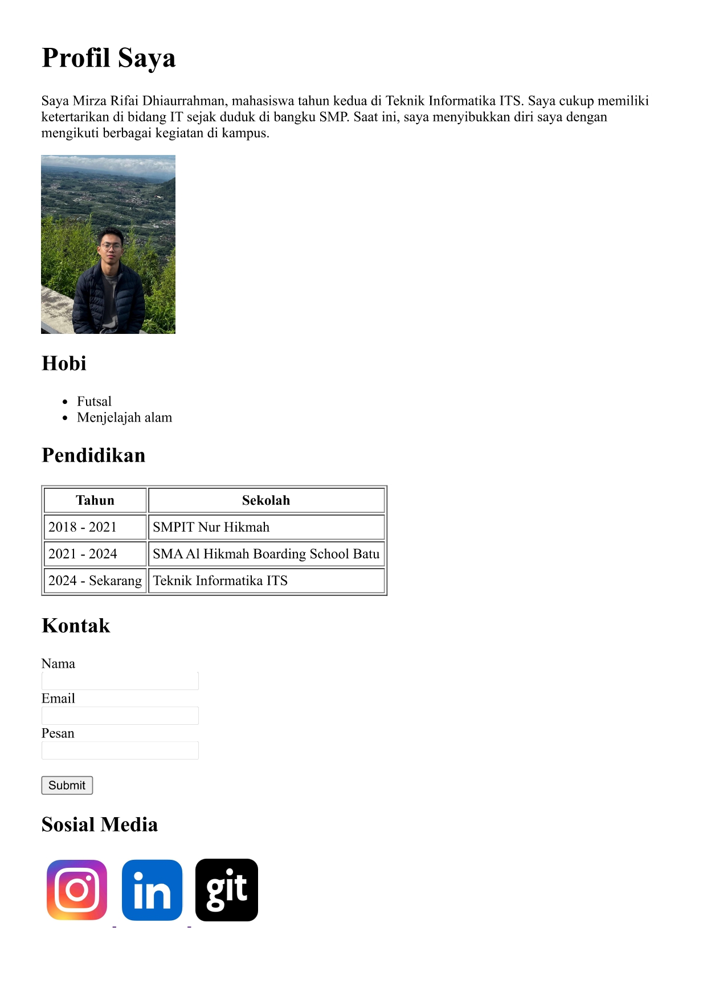

# Membuat Halaman Profil Sederhana
## Instruksi
Membuat file html sederhana yang menampilkan
- Judul profil (heading).
- Paragraf deskripsi.
- Foto diri (gambar).
- Daftar hobi (list).
- Riwayat pendidikan (tabel).
- Kontak sederhana (form).
- Media sosial (link).

## Laman Page

## Source Code
[profile.html](https://github.com/rifaidh/WebPro-Mirza-Rifai/edit/main/Pertemuan%202/profile.html)
