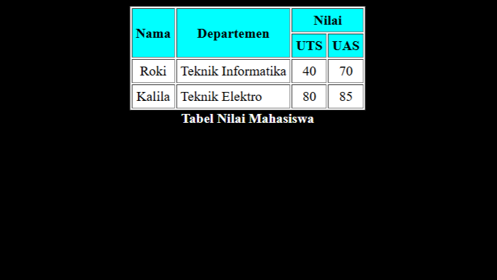
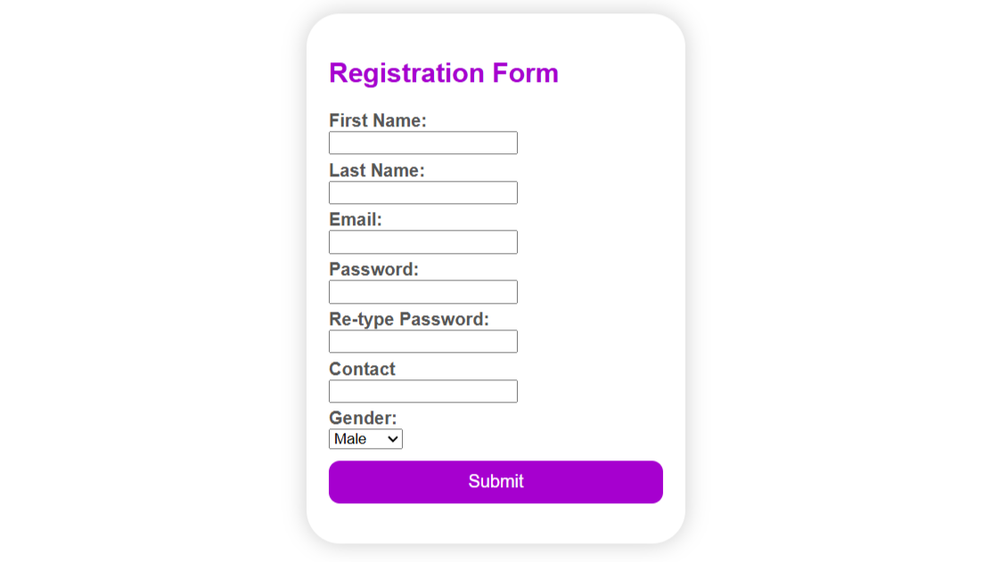
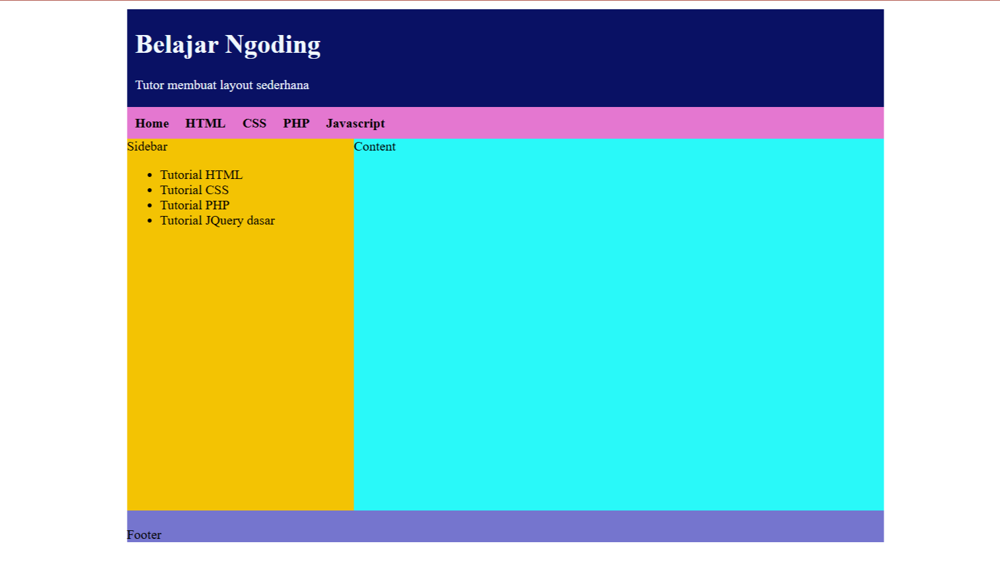

# Tugas Pertemuan 3
## Membuat Tabel
Menggunakan rowspan dan colspan untuk menggabukan kolom ataupun baris

Source code :
[Code](tabel.html)

## Membuat Form
Membuat website berisikan form dengan modifikasi CSS

Source code : [Code](form.html)

## Membuat Frsme
Membuat website berisikan layout dengan modifikasi CSS

Source code : [Code](frame.html)  
Css         : [CSS](style.css)
