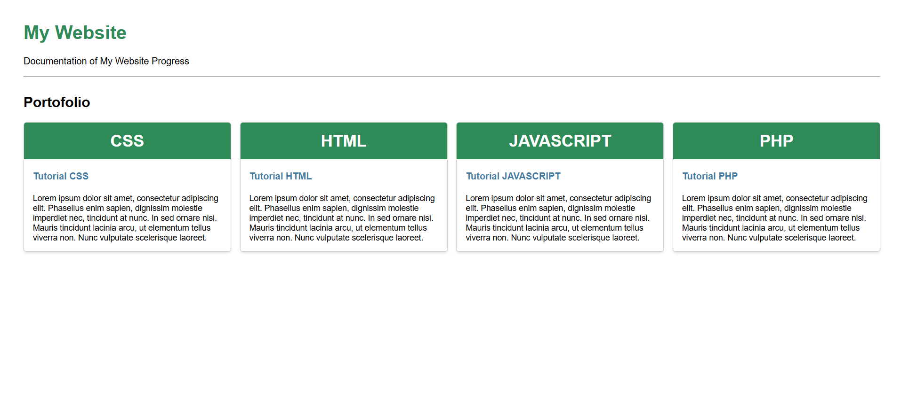

# Menggunakan CSS untuk Membuat Layout pada Web
Pada pertemuan 4, kita berlatih untuk membuat tampilan website yang mirip dengan web di bawah menggunakan CSS  

Saya membuat HTML saya dengan memisahkan beberapa bagian agar masing-masing memiliki stylenya tersendiri
- Keseluruhan Kotak `->` `full-container`
- Masing-masing Kotak `->` `container`
- Judul Kotak `->` `container-header`
- Judul Isi Kotak `->` `container-title`
- Isi Kotak `->` `container-body`

Source code :   
[HTML](week4.html)  
[CSS](style1.css)
